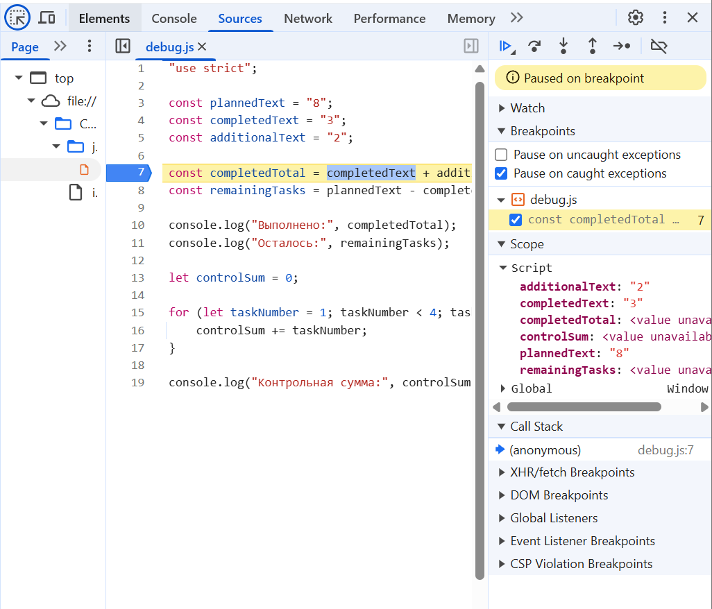

# Практическая работа №1

## Автор

Автор: Бараникови Георгий

Группа: ЭФБО-03-25

Вариант: 2

## Окружение

ОС: Windows 11

Node.js: v24.21.0

npm: 11.19.0

GIT: 2.55.0.windows.5

Browser: Yandex

## Запуск

node practice-01/js/hello.js

start practice-01/index.html (Для Windows)

node practice-01/js/types.js

node practice-01/js/progress.js

node practice-01/js/plan.js

node practice-01/js/debug.js

node practice-01/js/progress-input.js

## Задание №1

### Вариант 1:

Файл practice-01/js/hello.js запущен в VS code

Вывод появился в консоли VS code

Последняя строка - undefined

### Вариант 2:

Файл practice-01/index.html открыт в браузере Яндекс

Вывод файла practice-01/js/hello.js появился в консоли 
браузера

Последняя строка - object

### Различие

При запуске в VS code typeof document - undefined, при просмотре через браузер typeof document - object.

## Задание №2

| Выражение | Ожидание до запуска | Фактическое значение | Тип результата | Объяснение |
|---:|---:|---:|---|---|
| "8" + 2 | Error | 82 | string | JS неявно преобразует число в строку и производит объединение строк |
| "8" - 2 | Error | 6 | number | JS неявно преобразует строку в число и производит вычитание |
| Number("8") + 2 | 10 | 10 | number | Явно преобразуем строку в число и производим сложение |
| "12" > "3" | false | false | boolean | Сравнение происходи посимвольно по коду в Unicode, т.к. код "1" < код "3", то "12" < "3" |
| 12 === "12" | false | false | boolean | Сравнение происходит строгое, поэтому сравнивается как тип данных, так и значение |
| Number("") | error | 0 | number | Явное преобразование пустой строки в 0 из-за правила преобразования типов в JS |
| Number("text") | error | NaN | number | Т.к. мы пытаемся преобразовать в число то, что числом быть не может по правилу преобразования типов возвращается NaN, а Number() всегда возвращает тип данных number |
| Boolean("false") | true | true | boolean | Любая непустая строка всегда возвращает True |
| typeof null | null | object | string | Историческая ошибка, которая осталась из-за большого кол-ва кодов, которые опираются на данную механику |
| typeof NaN | NaN | number | string | Специальное значение типа number |

## Задание №3

| `totalTasks` | `completedTasks` | *Ожидаемое поведение/Итог* |
|---:|---:|---:|
| 12 | 5 | Осталось 7; прогресс 41.7%; статус "В работе". |
| 0 | 0 | Сообщение "Задач пока нет", без расчёта процента. |
| 5 | 0 | Осталось 5; прогресс 0.0%; статус «Не начато». |
| 5 | 5 | Осталось 0; прогресс 100.0%; статус "Завершено". |
| 5 | 6 | Ошибка: completedTasks должно быть в диапазоне от 0 до totalTasks |
| -1 | 0 | Ошибка: totalTasks должно быть в диапазоне от 0 до 1000 |
| 5 | 2.5 | Ошибка: totalTasks и completedTasks должны быть целыми числами |
| "5" | 2 | Ошибка: totalTasks и completedTasks должны быть числами |
| 1001 | 0 | Ошибка: totalTasks должно быть в диапазоне от 0 до 1000 |
| NaN | 0 | totalTasks и completedTasks должны быть целыми числами |
| 15 | 0 | Осталось 15; прогресс 0.0%; статус "Не начато" |

## Задание №4
| `totalTasks` | `completedTasks` | `dailyLimit` | *Ожидаемое поведение/Итог* |
|---:|---:|---:|---:|
| 12 | 5 | 3 | Осталось 7; прогресс 41.7%; статус "В работе". |
| 0 | 0 | 3 | Сообщение "Задач пока нет", без расчёта процента. |
| 5 | 0 | 10 | Осталось 5; прогресс 0.0%; статус «Не начато». |
| 5 | 5 | 2 | Осталось 0; прогресс 100.0%; статус "Завершено". |
| 5 | 6 | 2 | Ошибка: completedTasks должно быть в диапазоне от 0 до totalTasks |
| -1 | 0 | 0 | Ошибка: totalTasks должно быть в диапазоне от 0 до 1000 |
| 5 | 2.5 | 1.5 | Ошибка: totalTasks и completedTasks должны быть целыми числами |
| "5" | 2 | 2 | Ошибка: totalTasks и completedTasks должны быть числами |
| 1001 | 0 | "2" | Ошибка: totalTasks должно быть в диапазоне от 0 до 1000 |
| NaN | 0 | 1001 | totalTasks и completedTasks должны быть целыми числами |
| 15 | 0 | 4 | Осталось 15; прогресс 0.0%; статус "Не начато" |

## Задание №5

### Вывод программы с ошибкой  
Выполнено: 32  
Осталось: -24  
Контрольная сумма: 6  

| Ошибка | Что наблюдалось | Причина | Исправление | Результат после исправления |
|---|---|---|---|---|
| Обработка количества задач | Неправильное высчитывание переменных | Начальные данные были в виде строк | Сделать начальные константы числами | Корректное вычисление переменных |
| Граница цикла | Неправильно высчитывалась контрольная сумма | Неправильная граница | Замена "<4" на "<5" | Корректное вычисление контрольной суммы |

### Дополнительное задание

| `totalTasks` | `completedTasks` | *Ожидаемое поведение/Итог* |
|---:|---:|---:|
| "12" | "5" | Осталось 7; прогресс 41.7%; статус "В работе". |
| "abc" | "0" | Ошибка: totalTasks и completedTasks должны быть целыми числами. |
| "2.5" | "0" | Ошибка: totalTasks и completedTasks должны быть целыми числами. |
| "Infinity" | "5" | Ошибка: totalTasks и completedTasks должны быть целыми числами. |
| null | "6" | Ошибка: Вы передаете не строковое значение |
| undefined | "3" | Ошибка: Вы передаете не строковое значение |

Недостаточно просто вызвать `Number()` и проверить, что результат не отрицательный, потому что могут фигурировать такие значения как: `NaN`, `null`,`undefiend` - которые не имеют знака и не являются конкретным числом.

## Итог

Была освоена настройка рабочего места: установлено необходимо ПО, подготовлен GIT-репозиторий.

Было наглядно продемонстрирована разница между выполнением кода в консоли через node.js и браузере.

Были освоены основные типы переменных, а также способы их преобразования.

Была освоена возможность останавливать работу кода в процессе, чтобы исправлять ошибки или видеть отработку программы.

### Показательная ошибка
Самая показательная ошибка для меня - сложение двух переменных в задании 5, которые являются строками. Это наглядно показало, как работ "+" для строк.
